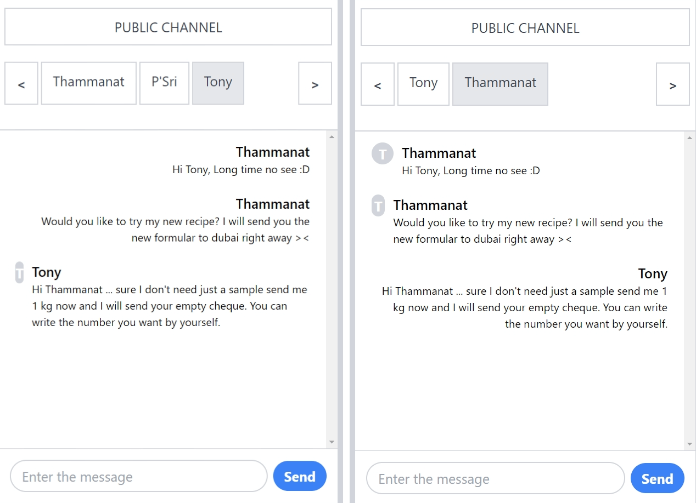

# ops-chat-project

At times, you might want to have confidential conversations that you don't want others to discover. This system operates without any chat logs or authentication requirements, which means that you can have peace of mind knowing that your discussions will remain confidential and won't be disclosed to anyone beyond the chat(Except screen capture :P ). This chat system offers both private and public chat options.

This site uses most of the recognized stack, including Spring Boot, Spring websocket, React.js, Sockjs and Tailwind.css. It has no database. Deploy locally.

*Not all features of the system are included in the repo due to confidentiality, unfinished code, and some other excuses.

